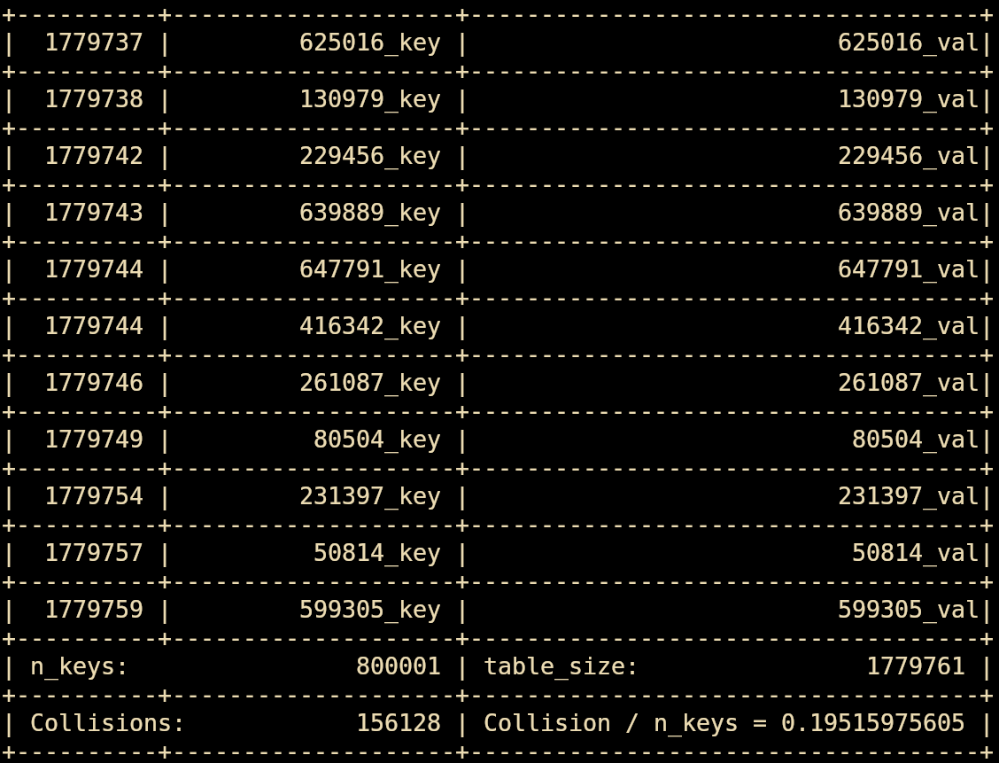

# Simple map in C

This minimal library implements a very simple map in C The map is implemented
with an Hash table, while the  collision are resolved with concatenation. 
In this map, keys are strings (char*) and values are again strings.
This is a minimalist choice, the value could be void *, in this way with some 
changes in the implementation (providing a size and a compare function in the init)
the hasmap could store any custom type defined by the user.
Altough you could use this interface if you need to	 
address objects with an almost costant time access, this implementation is a proof
of concept so i didn't care about security at all. Feel free to report me any bug or enanchment :D.

---

---

## API:

#### Initialization

`int map_init(HashTable *ht)`

Always init the map before using it.

#### Destruction

`int map_destroy(HashTable *ht)`

Always *destroy* the map when you finish using it.
If you allocated 'ht' in dinamic memory and you 'lose' his reference
before calling the *map_destroy*, memory will be leaked.

#### Adding [key:value] pair to the map

`int map_put(HashTable *ht, char* key, char *val)`

#### Retrieving a [key:value] pair from the map

`char **map_get(HashTable *ht, char* key)`

NULL is returned if the given key is not stored in the given map

#### Deleting a [key:value] pair from the map

`int map_del(HashTable *ht, char* key)`

#### 'Overload' the hash function

`void map_hashfun_overload(HashTable *ht, HashFun f)`

Since this library is a proof of concept it was fun to test some alternative
hash function to see the reduciton of performance using very bad functions.

Since this functionality was already implemented, feel free to change the 
hash function with your own. 

## Compilation

A simple main is provided, so you can directly test the map without writing your own.
A makefile is provided so you can just run `make` or `make run`.
`make run` will write the stdout to a file named *test.table*.
